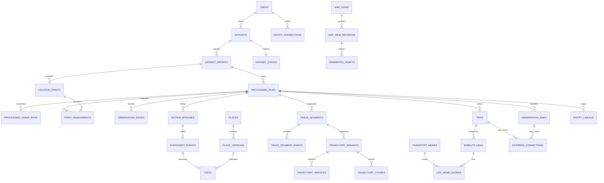

# RouteFrom 足迹数据实体关系与迁移修改清单

状态：设计基线，暂不执行迁移，不修改业务代码。

本文把已经讨论确定的足迹处理规格落实为目标数据库模型。它不是当前 `0001`—`0004` 迁移的描述，而是前端完成后实施数据库迁移时的权威设计输入。

## 1. 设计边界

- 原始 CSV 文件按 SHA-256 不可变保存；数据库中的导入点也不可被清洗或人工编辑覆盖。
- CSV 中 `wgsLatitude`、`wgsLongitude` 作为首选 WGS84 坐标；`latitude`、`longitude` 及所有原始哨兵值仍保留用于审计。
- 点质量、异常边、停留、地点、行程、交通方式和轨迹表示都是某次处理运行的派生结果。
- 同一数据集允许同时存在多个候选处理版本，但任何时刻只有一个激活版本对普通查询可见。
- 人工修正是独立的覆盖层，不回写原始点；新算法运行通过稳定逻辑 ID 和实体沿袭关系继承可迁移的锁定字段。
- 所有计算时间使用 `timestamptz`；所有区间使用左闭右开 `[)` 的 `tstzrange`。用户时区只负责解释和显示，不作为轨迹切分依据。
- 时间查询接收一个或多个不连续区间，数据库表达为 `tstzmultirange`；月、日只是前端可生成的选择，不是数据库固定粒度。
- WGS84 几何使用 SRID 4326；米制距离使用 `geography` 或合适的局部投影计算。
- 真实地图是可复现的第二层增强：任何地图匹配、OSM 地点边界或路线猜测都必须记录地图快照版本。
- 数据缺口表示“未观测”，通常对应未带手机、关机或应用未采到点；不得自动计入真实移动距离、停留时长或交通方式。

## 2. 总体实体关系

图中省略了部分关联表和复合外键。所有派生实体都必须能够追溯到 `dataset_id`、`processing_run_id` 和输入导入版本。

## 3. 版本模型

### 3.1 四类版本

1. **源文件版本**：`datasets` 以文件哈希标识一次不可变上传。
2. **导入版本**：`dataset_imports` 标识某个解析器版本对源文件的一次成功解释；`location_points` 从属于导入版本。
3. **处理版本**：`processing_runs` 标识完整算法流水线快照；`processing_stage_runs` 记录每个阶段的算法、参数和模型版本。
4. **展示版本**：`map_view_revisions` 保存完整地图状态；生成资产同时固定处理版本、地图配置版本和时间选择。

### 3.2 激活与回滚

`dataset_states` 为每个数据集保存：

- `active_import_id`：当前输入点版本；
- `active_processing_run_id`：普通 API 默认读取的已发布结果；
- `updated_at`、`lock_version`：原子切换和乐观锁。

处理流程先创建 `publication_status = 'candidate'` 的运行并写入全部派生表。验证完成后，在一个事务中把旧运行标记为 `superseded`、把新运行标记为 `active`，并更新 `dataset_states.active_processing_run_id`。回滚只需反向切换指针，不复制数据。

### 3.3 稳定实体 ID

会跨算法版本延续的派生表同时使用：

- `id`：某一处理版本中的物理行 ID；
- `logical_id`：用户眼中同一地点、停留、行程或交通分段的稳定 ID；
- `processing_run_id`：产生该物理版本的运行；
- 唯一约束 `(processing_run_id, logical_id)`。

`entity_lineage` 记录旧实体到新实体的 `carried`、`split`、`merged`、`replaced`、`dropped` 关系。只有 `carried` 或达到置信度阈值的关系才自动迁移人工锁；其余情况只产生待确认建议。

### 3.4 全表版本归属矩阵

| 表 | 版本键或生命周期 | 普通读取规则 |
| --- | --- | --- |
| `users` | 非版本化用户身份 | 按当前用户读取 |
| `datasets` | 不可变源文件版本，SHA-256 去重 | 由 `current_datasets` 选择当前数据集 |
| `current_datasets` | 可变用户指针 | 每用户一行 |
| `import_jobs` | 可清理的操作任务记录 | 不作为业务事实读取 |
| `dataset_imports` | `dataset_id + parser_version + parameters_hash` | 默认取 `dataset_states.active_import_id` |
| `dataset_states` | 可变发布指针 | 每数据集一行，事务内更新 |
| `processing_runs` | 完整流水线版本 | 默认取激活运行；预览显式指定候选运行 |
| `processing_stage_runs` | 从属于一个流水线运行的阶段版本 | 只通过所属运行读取 |
| `location_points` | 从属于不可变导入版本 | 通过处理运行的 `input_import_id` 读取 |
| `point_assessments` | `processing_run_id + point_id` | 只读所选处理运行 |
| `observation_edges` | 处理运行级 | 只读所选处理运行 |
| `observation_gaps` | 处理运行级，带稳定 `logical_id` | 只读所选处理运行 |
| `motion_episodes` | 处理运行级，带稳定 `logical_id` | 只读所选处理运行 |
| `stationary_events` | 处理运行级，带稳定 `logical_id` | 只读所选处理运行 |
| `places` | 用户级稳定逻辑身份 | 通过具体 `place_versions` 展示 |
| `place_versions` | 处理运行级地点快照 | 访问绑定精确版本，不读“最新一行” |
| `visits` | 处理运行级，带稳定 `logical_id` | 只读所选处理运行 |
| `track_segments` | 处理运行级，带稳定 `logical_id` | 只读所选处理运行 |
| `track_segment_points` | 随轨迹段版本 | 通过所属轨迹段读取 |
| `trajectory_variants` | 随轨迹段和处理运行版本 | 按用途和置信度选择首选/回退表示 |
| `trajectory_vertices` | 随轨迹表示版本 | 通过所属表示和精度阈值读取 |
| `trajectory_chunks` | 随轨迹表示版本，可重建缓存 | 通过所属表示、时间和空间范围读取 |
| `trips` | 处理运行级，带稳定 `logical_id` | 只读所选处理运行 |
| `trip_track_segments` | 随行程版本 | 通过所属行程读取 |
| `transport_modes` | schema 级参考数据 | 按有效词表读取，不随单次运行复制 |
| `mobility_legs` | 处理运行级，带稳定 `logical_id` | 只读所选处理运行 |
| `mobility_leg_segments` | 随交通分段版本 | 通过所属分段读取 |
| `leg_mode_scores` | 随交通分段和模型版本 | 通过所属分段读取 |
| `inferred_connections` | 处理运行级假设 | 与确认轨迹分层读取 |
| `map_data_snapshots` | 不可变外部地图数据快照 | 由处理运行或轨迹表示固定引用 |
| `entity_corrections` | 用户级、跨运行的可撤销覆盖事件 | 通过 `logical_id` 叠加到所选运行 |
| `entity_lineage` | 两个处理运行之间的映射版本 | 仅在迁移修正和审计时读取 |
| `transport_mode_labels` | 用户级持久训练标签 | 默认只进入该用户的训练集 |
| `model_versions` | 不可变模型制品版本 | 由 `processing_stage_runs.model_version_id` 固定引用 |
| `time_selections` | 用户保存的可变选择对象 | 查询时读取其规范化 `ranges` |
| `map_views` | 用户级稳定视图身份 | 通过 `current_revision_id` 展示 |
| `map_view_revisions` | 不可变展示配置版本 | 加载指定修订或当前修订 |
| `generated_assets` | 绑定处理、选择和配置版本的可丢弃缓存 | 只按完整 `cache_key` 命中 |

## 4. 源数据与运行控制

### `users`（保留并扩展）

职责：用户所有权、默认时区和后续行级安全边界。

核心字段：`id`、`auth_subject`、`display_name`、`timezone`、`created_at`、`updated_at`。

版本关系：非算法版本化；用户级人工修正、地点和私人模型都从属于它。

### `datasets`（修改）

职责：一份不可变源文件及其存储、哈希、总体时间范围和生命周期。

核心字段：现有文件字段，加 `source_format`、`source_app`、`source_app_version`、`coordinate_profile`、`metadata`。保留 `recorded_from`、`recorded_to` 作为导入摘要。

修改要点：

- 删除或废弃含义模糊的 `parser_version`、`processing_version`，版本分别归入导入和处理运行。
- `point_count`、`rejected_point_count` 仅作为当前激活导入的缓存摘要，不作为算法事实来源。
- 文件本体仍在本地或对象存储，不存入 Postgres。

### `current_datasets`（保留）

职责：选择用户当前打开的数据集，与算法激活版本无关。

核心字段：`user_id`、`dataset_id`、`activated_at`。

### `import_jobs`（保留为操作表）

职责：上传和解析任务的队列状态、进度、错误与重试，不承载成功导入的长期版本身份。

新增字段：`attempt_number`、`worker_id`、`heartbeat_at`、`cancel_requested_at`。

### `dataset_imports`（新增）

职责：记录一次可复现的 CSV 解析结果。

核心字段：

- `id`、`dataset_id`、`import_job_id`；
- `parser_name`、`parser_version`、`schema_version`；
- `parameters`、`parameters_hash`；
- `status`：`running | succeeded | failed | cancelled`；
- `row_count`、`accepted_row_count`、`structurally_rejected_row_count`；
- `recorded_range tstzrange`、`metrics`、`error_message`；
- `started_at`、`completed_at`。

约束：只有 `succeeded` 的导入可以被 `dataset_states.active_import_id` 或处理运行引用。

### `dataset_states`（新增）

职责：保存数据集当前激活的导入和处理运行，是原子发布与回滚的唯一入口。

核心字段：`dataset_id`、`active_import_id`、`active_processing_run_id`、`lock_version`、`updated_at`。

### `processing_runs`（重构）

职责：完整足迹流水线的一次候选、发布或历史快照。

核心字段：

- `id`、`dataset_id`、`input_import_id`、`parent_run_id`；
- `pipeline_name`、`pipeline_version`、`code_revision`；
- `configuration`、`configuration_hash`；
- `map_snapshot_id`；
- `execution_status`：`queued | running | succeeded | failed | cancelled`；
- `publication_status`：`candidate | active | superseded | rejected`；
- `metrics`、`error_message`、`started_at`、`completed_at`、`activated_at`。

约束：每个数据集至多一个 `publication_status = 'active'`；`active` 必须同时为 `succeeded`。

### `processing_stage_runs`（新增）

职责：逐阶段记录异常检测、状态推断、停留识别、地点归并、行程切分、交通方式、地图匹配、平滑和 LOD 的真实版本。

核心字段：`id`、`processing_run_id`、`stage_name`、`sequence_number`、`algorithm_name`、`algorithm_version`、`model_version_id`、`parameters`、`parameters_hash`、`status`、`metrics`、开始/完成时间。

约束：`(processing_run_id, stage_name)` 唯一；后续阶段不得引用另一处理运行的中间结果。

## 5. 不可变定位点与质量评估

### `location_points`（重构为导入事实表）

职责：保存解析后的源行和标准化坐标，不包含任何可随算法变化的判断。

核心字段：

- 身份：`id bigint`、`dataset_id`、`dataset_import_id`、`source_row_number`、`row_fingerprint`；
- 时间：`source_geo_time_epoch_ms`、`recorded_at`、`source_day_time_epoch_ms`、`local_date`、`timezone`；
- 坐标：`source_latitude`、`source_longitude`、`source_coordinate_system`、`source_wgs_latitude`、`source_wgs_longitude`、`position_wgs84 geometry(Point,4326)`；
- 传感器原值：`source_altitude`、`source_course`、`source_horizontal_accuracy`、`source_vertical_accuracy`、`source_speed`；
- 标准化值：`altitude_meters`、`course_degrees`、`horizontal_accuracy_meters`、`vertical_accuracy_meters`、`recorded_speed_mps`，其中 `-1` 等缺失哨兵标准化为 `NULL`；
- 环境：`network_type`、`network_name`、`location_type`；
- 审计：`normalization_flags`、`created_at`。

必须移出：`calculated_speed_mps`、`quality_flags`、`is_valid`。这些值属于处理版本，不能固化在原始点上。

约束：`(dataset_import_id, source_row_number)` 唯一；导入成功后禁止 `UPDATE` 和单行 `DELETE`，只能随整个未激活导入版本清理。

### `point_assessments`（新增）

职责：在某次处理运行中对每个点给出可解释的质量结论和各任务权重。

核心字段：`processing_run_id`、`point_id`、`quality_status`（`valid | suspect | excluded`）、`anomaly_score`、`path_weight`、`stay_weight`、`mode_weight`、`reason_codes text[]`、`features jsonb`、`explanation jsonb`、`stage_run_id`。

约束：`(processing_run_id, point_id)` 唯一；权重和分数均在 `[0,1]`。精度差只能降低权重或参与综合分数，不能单独触发删除。

### `observation_edges`（新增）

职责：保存点之间的上下文关系，使瞬移、折返、三点绕过和连续性判断可以审计。

核心字段：

- `id`、`processing_run_id`、`from_point_id`、`to_point_id`；
- `edge_kind`：`adjacent | bypass`；
- `decision`：`selected | rejected | gap`；
- `elapsed_seconds`、`displacement_meters`、`calculated_speed_mps`、`bearing_degrees`；
- `continuity_score`、`reason_codes`、`features`、`stage_run_id`。

规则：孤立瞬移点只有在前后邻点形成高置信连续边时才允许以 `bypass` 绕过；否则轨迹在此处断开。

### `observation_gaps`（新增）

职责：显式表示两个可靠观测之间的未知时间，避免把缺口误当移动或停留。

核心字段：`id`、`logical_id`、`processing_run_id`、`before_point_id`、`after_point_id`、`gap_range tstzrange`、`cause`（`source_sampling_gap | excluded_block | clock_discontinuity | unknown`）、`context_before`、`context_after`、`same_place_probability`、`confidence`、`evidence`。

规则：

- 缺口本身不产生真实路径、距离和交通方式；
- 位于同一地点两侧时，缺口时间只能标为“可能停留”，不能并入确认停留时长；
- 可生成独立的虚线猜测，但猜测数据必须进入 `inferred_connections`。

## 6. 运动状态、停留与地点

### `motion_episodes`（新增）

职责：保存带缓冲和置信度的运动状态序列，是 HSMM/状态模型的输出。

核心字段：`id`、`logical_id`、`processing_run_id`、`sequence_number`、`state`（`moving | possible_stop | stationary | possible_departure | unknown`）、`observed_range tstzrange`、首末点、`centroid`、`confidence`、`evidence`、`stage_run_id`。

### `stationary_events`（新增）

职责：保存物理层静止事件，并把物理静止与语义访问分开。

核心字段：

- `id`、`logical_id`、`processing_run_id`、`motion_episode_id`；
- `observed_range tstzrange`：有点支持的确认范围；
- `possible_range tstzrange`：考虑边界采样和缺口后的可能范围，必须包含确认范围；
- `centroid`、`spatial_extent geometry(MultiPolygon,4326)`、`point_count`；
- `event_type`：`visit | transport_pause | uncertain_stop`；
- `open_start`、`open_end`、`confidence`、`evidence`、`stage_run_id`。

说明：停留没有全局固定“五分钟”或固定“五点”门槛。持续时间、空间收敛、采样密度、前后运动、历史地点和地图语义共同决定结果。

### `places`（重构为稳定身份表）

职责：保存用户眼中长期存在的地点身份，不直接保存会随算法变化的几何和地理编码结果。

核心字段：`id`、`user_id`、`created_at`、`retired_at`、`manually_created`。

### `place_versions`（新增）

职责：保存某次处理运行中地点的边界、层级和语义快照。

核心字段：

- `id`、`place_id`、`processing_run_id`、`parent_place_version_id`；
- `centroid`、`boundary geometry(MultiPolygon,4326)`；
- `boundary_source`：`learned | osm | manual | hybrid`；
- `name`、`category`、`address`、`city`、`region`、`country_code`、`timezone`；
- `osm_snapshot_id`、`osm_element_type`、`osm_element_id`；
- `confidence`、`geocoding_provider`、`geocoding_payload`、`source_kind`、`created_at`。

规则：一个地点可嵌套在另一个地点内；父级必须属于同一用户且不能形成环。访问只绑定最具体的主地点，父级通过层级查询获得，避免重复计数。

### `visits`（重构为语义访问表）

职责：表示被判定为访问的静止事件，是闭合行程的边界；交通暂停和不确定静止不创建访问行。

核心字段：`id`、`logical_id`、`processing_run_id`、`stationary_event_id`、`place_version_id`、`status`（`candidate | confirmed | rejected`）、`arrival_confidence`、`departure_confidence`、`overall_confidence`、`evidence`、`created_at`。

说明：时间范围和点数从 `stationary_events` 读取，不重复保存 `started_at`、`ended_at`、`duration_seconds`。后续数据可以在新处理运行中重新分类早期事件，旧结果仍可回看。

## 7. 连续轨迹、地图匹配和多精度

### `track_segments`（重构）

职责：表示不跨真实观测缺口的一段连续可靠观测序列；它是拓扑容器，不再只等同于一条 `LineString`。

核心字段：`id`、`logical_id`、`processing_run_id`、`sequence_number`、`observed_range tstzrange`、`first_point_id`、`last_point_id`、`point_count`、`has_gap_before`、`has_gap_after`、`confidence`、`stage_run_id`。

### `track_segment_points`（新增，替代缺失的点成员关系）

职责：按顺序把清洗后的观测点加入连续轨迹段。

核心字段：`track_segment_id`、`point_id`、`sequence_number`、`role`（`normal | semantic_anchor | boundary_anchor`）、`effective_weight`。

约束：段内 `sequence_number` 和 `point_id` 均唯一；时间必须严格递增。

### `trajectory_variants`（新增）

职责：为同一连续段保存互不覆盖的轨迹表示。

核心字段：

- `id`、`track_segment_id`、`processing_run_id`；
- `variant_kind`：`cleaned_gps | smoothed_gps | map_matched`；
- `path geometry(LineString,4326)`、`distance_meters`、`confidence`；
- `map_snapshot_id`、`stage_run_id`；
- `preferred_for_display`、`preferred_for_distance`、`fallback_reason`、`metadata`。

规则：原始点永远不变；平滑不能跨缺口，不能移动停留/行程边界等语义锚点。地图匹配只有高置信度时成为首选，否则自动回退到平滑或清洗 GPS。

### `trajectory_vertices`（新增）

职责：保存轨迹表示中的有序顶点、时间以及连续多精度抽稀的重要度。

核心字段：`trajectory_variant_id`、`sequence_number`、`recorded_at`、`position`、`source_point_id`（匹配新增顶点可为空）、`is_interpolated`、`is_semantic_anchor`、`importance_score`。

规则：所有端点、缺口两侧、停留边界、行程边界和交通方式切换点都是不可删除锚点。其余点通过受约束的 Douglas–Peucker 或 Visvalingam–Whyatt 计算单调重要度；查询时按像素误差预算选择阈值，而不是按全局/月/日预生成固定轨迹。

### `trajectory_chunks`（新增）

职责：把大轨迹拆成与日历无关、适合空间时间裁剪和 GPU 传输的块。

核心字段：`id`、`trajectory_variant_id`、`chunk_number`、`time_range tstzrange`、`first_vertex_sequence`、`last_vertex_sequence`、`vertex_count`、`path`、`bounds`、`min_importance`、`max_importance`、`binary_object_key`、`content_hash`。

切块原则：按最大顶点数、最大编码字节数、真实缺口和语义边界切块；绝不以自然月或自然日作为强制边界。

## 8. 行程、交通方式和未知连接

### `trips`（重构）

职责：表示两个确认访问之间的完整移动过程，也允许数据边界处的开放行程。

核心字段：

- `id`、`logical_id`、`processing_run_id`、`sequence_number`；
- `start_visit_id`、`end_visit_id`；
- `boundary_state`：`closed | open_start | open_end | open_both`；
- `observed_range tstzrange`、`observed_distance_meters`、`straight_distance_meters`；
- `has_observation_gap`、`confidence`、`evidence`、`stage_run_id`。

必须移出：单一 `inferred_transport_mode`、`transport_confidence`、`manual_transport_mode`。行程可包含多个交通方式分段。

### `trip_track_segments`（新增，替代 `trip_segments`）

职责：按顺序关联行程和一个或多个连续轨迹段，并允许记录在段内的裁剪范围。

核心字段：`trip_id`、`track_segment_id`、`sequence_number`、`included_range tstzrange`。

### `transport_modes`（新增查找表）

职责：维护可扩展的层级交通方式词表。

核心字段：`code`、`parent_code`、`display_name`、`level`、`sort_order`、`is_active`。

第一版至少包含：

- `pedestrian` → `walk`、`run`；
- `cycle` → `bicycle`、`e_bike`；
- `road_vehicle` → `car`、`bus`、`motorcycle`、`scooter`；
- `rail` → `metro`、`train`；
- `air`、`boat`、`unknown`。

证据不足时只输出上层类别，不强迫细分类。

### `mobility_legs`（新增）

职责：保存行程内部交通方式近似稳定的有序分段。

核心字段：`id`、`logical_id`、`processing_run_id`、`trip_id`、`sequence_number`、`observed_range tstzrange`、`start_position`、`end_position`、`selected_mode_code`、`selected_mode_level`、`confidence`、`feature_schema_version`、`features`、`evidence`、`stage_run_id`。

### `mobility_leg_segments`（新增）

职责：将交通分段关联到一个或多个连续轨迹段。

核心字段：`mobility_leg_id`、`track_segment_id`、`sequence_number`、`included_range tstzrange`。

### `leg_mode_scores`（新增）

职责：保存可解释概率模型对每个候选交通方式的后验概率和证据贡献。

核心字段：`mobility_leg_id`、`mode_code`、`probability`、`evidence`。

约束：同一分段各候选概率和在数值容差内为 1；被选择模式必须来自该分布。第一版使用速度、加速度、停顿结构、道路/轨道/水路邻近度、路线拓扑和前后上下文，后续可替换成利用人工标签训练的模型。

### `inferred_connections`（新增）

职责：单独保存缺口、开放起点和开放终点的虚线猜测。

核心字段：`id`、`processing_run_id`、`connection_kind`（`gap | inferred_origin | inferred_destination`）、`observation_gap_id`、`trip_id`、`time_range`、`start_position`、`end_position`、`path`、`hypothesized_mode_code`、`confidence`、`map_snapshot_id`、`evidence`、`created_at`。

硬性规则：表中不设置可汇入真实统计的 `distance_meters` 字段。所有读取接口必须明确返回 `is_inferred = true`；低于展示阈值时不生成或不展示。

## 9. 地图数据、人工修正和学习

### `map_data_snapshots`（新增）

职责：记录本地 OSM/道路网络数据的可复现版本，不直接取代专用的 OSM 导入 schema。

核心字段：`id`、`provider`、`region_key`、`source_timestamp`、`source_url`、`source_sha256`、`schema_version`、`storage_reference`、`bounds`、`imported_at`、`metadata`。

说明：道路网络、轨道和面状 POI 可由 osm2pgsql 或独立图数据存储管理；`app` schema 只保存快照元数据和引用。

### `entity_corrections`（新增）

职责：保存用户对地点、停留、访问、行程或交通分段的可撤销补丁和字段锁。

核心字段：`id`、`user_id`、`dataset_id`、`entity_type`、`entity_logical_id`、`base_processing_run_id`、`patch jsonb`、`locked_fields text[]`、`status`（`active | revoked | superseded`）、`reason`、`created_at`、`updated_at`、`revoked_at`。

规则：一次修正默认只作用于选中对象；相似记录只产生建议，不静默批量修改。

### `entity_lineage`（新增）

职责：在相邻处理版本之间建立派生实体的沿袭、拆分和合并关系。

核心字段：`id`、`from_processing_run_id`、`to_processing_run_id`、`entity_type`、`from_entity_id`、`to_entity_id`、`relation_type`、`overlap_score`、`confidence`、`metadata`。

### `transport_mode_labels`（新增，机器学习预留）

职责：把明确的人工交通方式修正保存为个人训练标签。

核心字段：`id`、`user_id`、`dataset_id`、`mobility_leg_logical_id`、`source_correction_id`、`mode_code`、`feature_schema_version`、`features_snapshot`、`consent_scope`（第一版固定 `personal`）、`created_at`、`revoked_at`。

### `model_versions`（新增，机器学习预留）

职责：记录可复现的个人或未来经单独同意的共享模型。

核心字段：`id`、`model_kind`、`owner_user_id`、`version`、`feature_schema_version`、`training_data_hash`、`artifact_object_key`、`metrics`、`status`、`created_at`。

规则：默认仅训练和使用个人模型。跨用户模型必须另行获得同意，并且训练特征不得包含可还原个人地点的绝对坐标。

## 10. 任意多时间切片与地图状态

### `time_selections`（新增）

职责：保存可复用的任意时间范围或多个不连续切片。

核心字段：`id`、`user_id`、`dataset_id`、`title`、`ranges tstzmultirange`、`display_timezone`、`normalized_hash`、`created_at`、`updated_at`。

规则：

- 空选择、单区间和多区间使用同一接口；
- 写入前合并相交或相邻区间并转成 `[)`；
- 查询按 `ranges && entity_range` 初筛，再在区间边界裁剪线段；
- API 也可直接接收临时区间数组，不要求先保存为 `time_selections`。

### `map_views`（重构为稳定身份表）

职责：保存地图视图的名称、所有权、分享状态和当前修订指针。

核心字段：`id`、`user_id`、`title`、`description`、`slug`、`visibility`、`share_token_hash`、`current_revision_id`、`created_at`、`updated_at`。

### `map_view_revisions`（新增）

职责：不可变保存完整地图状态，采用类似 Kepler.gl 的带 schema 版本序列化方式。

核心字段：

- `id`、`map_view_id`、`revision_number`；
- `config_schema_version`、`config jsonb`、`config_hash`；
- `dataset_id`、`processing_run_id`、`run_binding`（`pinned | active`）；
- `time_selection_id`、`inline_time_ranges tstzmultirange`；
- `created_by`、`created_at`。

`config` 必须包含图层、字段映射、过滤器、颜色比例、交互、相机、底图样式和 UI 状态。加载旧版本时先经 schema 迁移器升级，禁止让前端猜测缺失字段。

### `generated_assets`（重构）

职责：缓存矢量瓦片、GPU 二进制缓冲、缩略图、导出和报告等派生文件。

核心字段：

- `id`、`dataset_id`、`processing_run_id`、`map_view_revision_id`；
- `asset_kind`：开放的受控文本，不再含 `month_track`、`day_track` 语义；
- `selection_ranges tstzmultirange`、`selection_hash`；
- `bounds`、`precision_key`、`config_hash`、`cache_key`；
- `object_key`、内容类型/编码、大小、点数、`content_hash`、`metadata`、`created_at`、`expires_at`。

唯一性：使用所有输入规范化后计算的 `cache_key` 唯一约束，至少包含数据集、处理运行、时间多区间、空间范围、精度、地图视图修订和资产生成器版本。不得再使用 `period_key`。

## 11. 查询和精度契约

轨迹读取 API 的数据库输入至少包括：

- `dataset_id`；
- `processing_run_id`，省略时解析为激活运行；
- `time_ranges tstzmultirange`；
- 可选空间范围；
- `pixel_tolerance` 或目标顶点预算；
- 轨迹偏好：`map_matched → smoothed_gps → cleaned_gps`。

处理顺序：

1. 用时间多区间和空间范围筛选 `trajectory_chunks`；
2. 在每个区间边界对线段进行时间裁剪，区间之间绝不连线；
3. 根据屏幕误差或顶点预算选择 `importance_score` 阈值；
4. 强制补回所有语义锚点；
5. 输出连续实线轨迹；
6. 单独输出达到阈值的 `inferred_connections` 虚线图层。

热力图、点图层和聚合图层直接使用相同的 `tstzmultirange` 过滤契约。大点集优先输出 Arrow/二进制列式缓冲交给 deck.gl GPU 渲染；聚类计算是否在 CPU 或 GPU 由图层实现决定，数据库模型不伪装为“全部 GPU”。

## 12. 关键约束与索引清单

- 所有派生表建立 `(processing_run_id, ...)` 前缀索引，防止候选版本混读。
- `location_points` 建立 `(dataset_import_id, recorded_at, id)` B-tree；数据量明显增大后增加 BRIN，而不是现在就分区。
- 点、地点、轨迹、边界建立 GiST 空间索引；米制近邻查询明确转换为 `geography`。
- `tstzrange` 和 `tstzmultirange` 查询列建立 GiST 索引。
- 所有区间要求非空；`possible_range @> observed_range`。
- 同一连续轨迹段内时间严格递增；任何实线轨迹不得跨 `observation_gaps`。
- 每个数据集最多一个激活处理运行；每个地图视图最多一个当前修订。
- 用复合外键确保点、运行、行程、轨迹段和访问来自同一数据集，不能只依赖应用层检查。
- 地点层级必须无环；同一版本中每个地点至多一个父地点。
- 每个轨迹段最多一个首选展示表示和一个首选距离表示，可用部分唯一索引实现。
- 真实距离只从连续确认轨迹计算；`inferred_connections` 永不参与真实距离汇总。
- JSONB 仅保存算法证据、参数和可扩展配置；常用过滤、连接、排序字段必须是类型化列。

## 13. 现有迁移冲突与处理决定

| 现有对象 | 当前问题 | 目标处理 |
| --- | --- | --- |
| `datasets.parser_version` / `processing_version` | 无法表示多个导入和候选处理版本 | 移至 `dataset_imports`、`processing_runs`、`processing_stage_runs` |
| `processing_runs.algorithm` | 一行只能描述一个算法阶段，且无候选/激活状态 | 重构为流水线运行，新增阶段运行和发布状态 |
| `location_points.calculated_speed_mps` | 依赖相邻点和算法版本 | 移至 `observation_edges` |
| `location_points.quality_flags/is_valid` | 把算法判断写死在原始点 | 移至 `point_assessments` |
| `places.boundary Polygon` | 不能表达多面、层级和历史版本 | 拆为 `places` + `place_versions`，使用 `MultiPolygon` |
| `visits` 的闭合时间与固定点数 | 无法表达可能范围、开放边界和两阶段停留语义 | 新增 `stationary_events`，`visits` 只保留语义访问 |
| `track_segments.path` | 清洗、平滑、地图匹配互相覆盖且没有点成员 | 路径移至 `trajectory_variants`，新增成员、顶点和块 |
| `trips.inferred_transport_mode` | 一个行程只能有一种方式 | 移至 `mobility_legs` + `leg_mode_scores` |
| `trips` 强制起止时间闭合 | 不能表示数据边界处开放行程 | 增加 `boundary_state` 和可空访问边界 |
| `trip_segments` | 不能表达裁剪范围和交通分段 | 替换为 `trip_track_segments`、`mobility_leg_segments` |
| `map_views.config` 可变单行 | 不能可靠恢复旧 schema 或固定处理版本 | 拆为稳定视图和不可变 `map_view_revisions` |
| `generated_assets.asset_kind/period_key` | 固定月、日，与任意多时间切片冲突 | 改用 `selection_ranges`、规范化哈希和通用资产类型 |

## 14. 将来实施时的迁移拆分

现阶段不创建以下 SQL 文件。前端完成并开始编码时，按依赖顺序实施：

### `0005_import_and_version_foundation.sql`

- 新增 `dataset_imports`、`dataset_states`、`processing_stage_runs`、`map_data_snapshots`；
- 重构 `processing_runs` 的输入、执行和发布字段；
- 建立激活运行部分唯一索引和跨数据集复合外键。

### `0006_immutable_location_points.sql`

- 扩展源 CSV 全字段和 WGS84 标准化字段；
- 增加 `dataset_import_id`；
- 把 `-1` 等哨兵保留在 source 列并在标准化列写 `NULL`；
- 迁出 `calculated_speed_mps`、`quality_flags`、`is_valid`；
- 加入不可变保护和点时空索引。

### `0007_point_quality_and_observation_graph.sql`

- 新增 `point_assessments`、`observation_edges`、`observation_gaps`；
- 建立运行、点、时间范围和质量状态索引。

### `0008_motion_stays_and_place_versions.sql`

- 新增 `motion_episodes`、`stationary_events`、`place_versions`；
- 将 `places` 改为稳定身份；
- 重构 `visits` 为语义访问并迁移旧数据。

### `0009_trajectory_variants_and_lod.sql`

- 重构 `track_segments`；
- 新增 `track_segment_points`、`trajectory_variants`、`trajectory_vertices`、`trajectory_chunks`；
- 建立路径、块范围、顶点重要度和首选表示约束。

### `0010_trips_modes_and_inferences.sql`

- 重构 `trips`；
- 替换 `trip_segments`；
- 新增交通方式词表、`mobility_legs`、关联表、概率表和 `inferred_connections`。

### `0011_corrections_lineage_and_models.sql`

- 新增 `entity_corrections`、`entity_lineage`；
- 预留 `transport_mode_labels`、`model_versions`；
- 实现人工锁迁移所需索引，但不在数据库触发器中实现相似记录自动传播。

### `0012_time_selections_map_revisions_and_assets.sql`

- 新增 `time_selections`、`map_view_revisions`；
- 重构 `map_views` 和 `generated_assets`；
- 清除固定 `month_track`、`day_track` 和 `period_key` 的数据库语义。

### `0013_read_models_and_integrity.sql`

- 创建仅暴露激活运行的默认读取视图；
- 创建管理员/预览接口使用的候选版本视图；
- 增加跨表一致性触发器或约束、发布事务函数、回滚函数；
- 在身份方案确定后补齐 RLS，浏览器不得持有服务端数据库连接凭据。

## 15. 实施前门槛

开始写迁移和算法代码前必须确认：

1. `0001`—`0004` 是否已经在任何共享数据库执行。若从未执行，可在首次基线中直接整理；若已执行，只允许追加兼容迁移，不能改写历史文件。
2. 前端最终使用的时间选择、地图配置和轨迹响应类型与本文契约一致。
3. 选择 PostgreSQL 版本支持 `tstzmultirange`，并确认 Neon/PostGIS 扩展版本。
4. 明确本地 OSM 快照的导入工具、存储位置和更新策略。
5. 用真实 CSV 建立算法验收样例，至少覆盖长沙—厦门交替瞬移、超长精度尾部、`-1` 哨兵、长观测缺口、开放行程和多段不连续时间选择。

在这些门槛满足之前，只维护本设计文档，不提前固化迁移 SQL。
